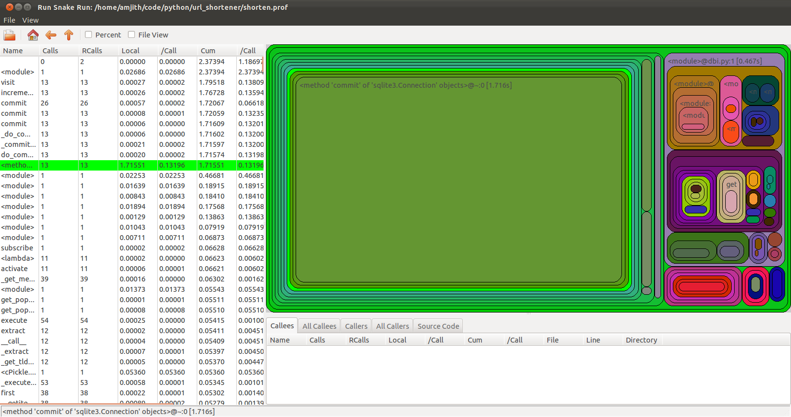
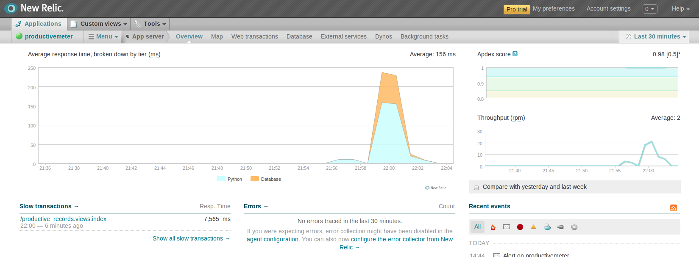

.. include:: beamerdefs.txt

================
Python Profiling
================

:Organization: UTOS
:Author: Amjith Ramanujam
:Date: @amjithr

Profiling a Python Script
-------------------------

|block<| What is Profiling? |>|

Where is the time spent?

|end_block|

|pause|

|block<| Why? |>|

- Know the bottle-necks.
- Optimize intelligently.

|end_block|

`In God we trust everyone else bring data.`

Profiling Tools
---------------

|block<| Standard Library |>|

- cProfile
- Profile  (older pure python implementation)
- hotshot  (deprecated)
- timeit

|end_block|

|block<| Third Party |>|

- line_profiler
- memory_profiler

|end_block|

|block<| Commercial - Web Application |>|

- New Relic

|end_block|

cProfile
--------

|section<| cProfile |>|

|section_tag| Introduction

|end_section|

Let's use cProfile
------------------

.. code-block::

   $ python -m cProfile lcm.py 
     7780242 function calls in 4.474 seconds
    
    Ordered by: standard name
   
    ncalls  tottime  percall  cumtime  percall filename:lineno(function)
         1    0.000    0.000    4.474    4.474 lcm.py:3(<module>)
         1    2.713    2.713    4.474    4.474 lcm.py:3(lcm)
   3890120    0.881    0.000    0.881    0.000 {max}
         1    0.000    0.000    0.000    0.000 {method 'disable' of '_lsprof.Profiler' objects}
   3890119    0.880    0.000    0.880    0.000 {min}

    
Lowest Common Multiplier
------------------------

**Problem**

Given two numbers a,b find the lowest number c that is divisible by both a and b.
eg: lcm(2,3) is 6

|pause|

**Algorithm:**

::

    1. Start i from the max(a,b)
    2. If i is perfectly divisible by a and b
        i is the answer
    3. Increment i by max(a,b). Goto Step 1.

Lowest Common Multiplier (ver 1)
--------------------------------

.. code-block:: python

    # lcm.py
    def lcm(arg1, arg2):
        i = max(arg1, arg2)
        while i < (arg1 * arg2):
            if i % min(arg1,arg2) == 0:
                return i
            i += max(arg1,arg2)
        return(arg1 * arg2)

    lcm(21498497, 3890120)

Let's Profile (ver 1)
---------------------
    
.. code-block::

   $ python -m cProfile lcm.py 
     7780242 function calls in 4.474 seconds
    
    Ordered by: standard name
   
    ncalls  tottime  percall  cumtime  percall filename:lineno(function)
         1    0.000    0.000    4.474    4.474 lcm.py:3(<module>)
         1    2.713    2.713    4.474    4.474 lcm.py:3(lcm)
   3890120    0.881    0.000    0.881    0.000 {max}
         1    0.000    0.000    0.000    0.000 {method 'disable' of '_lsprof.Profiler' objects}
   3890119    0.880    0.000    0.880    0.000 {min}

Lowest Common Multiplier (ver 2)
--------------------------------

.. code-block:: python

    # lcm.py
    def ver_2(arg1, arg2):
        mx = max(arg1, arg2)
        mn = min(arg1, arg2)
        i = mx
        while i < (arg1 * arg2):
            if i % mn == 0:
                return i
            i += mx
        return(arg1 * arg2)

Let's Profile (ver 2)
---------------------

.. code-block:: 

   $ python -m cProfile lcm.py 
     5 function calls in 0.774 seconds

   Ordered by: standard name
   ncalls  tottime  percall  cumtime  percall filename:lineno(function)
        1    0.000    0.000    0.763    0.763 lcm.py:2(<module>)
        1    0.763    0.763    0.763    0.763 lcm.py:2(lcm)
        1    0.000    0.000    0.000    0.000 {max}
        1    0.000    0.000    0.000    0.000 {method 'disable' of '_lsprof.Profiler' objects}
        1    0.000    0.000    0.000    0.000 {min}

pstats
------

|section<| cProfile |>|

|section_tag| Large Programs

|end_section|

Profiling Large Programs
------------------------

.. code-block:: 

   $ python -m cProfile shorten.py 
    95657 function calls (93207 primitive calls) in 1.858 seconds

    Ordered by: standard name

  ncalls  tottime  percall  cumtime  percall filename:lineno(function)
       39    0.000    0.000    0.001    0.000 <string>:1(<lambda>)
        1    0.000    0.000    0.000    0.000 <string>:1(<module>)
        1    0.000    0.000    0.000    0.000 <string>:1(AnnotatedAlias)
        1    0.000    0.000    0.000    0.000 <string>:1(AnnotatedBooleanClauseList)
        1    0.000    0.000    0.000    0.000 <string>:1(AnnotatedCTE)
        1    0.000    0.000    0.000    0.000 <string>:1(AnnotatedClauseElement)
        1    0.000    0.000    0.000    0.000 <string>:1(AnnotatedClauseList)
        1    0.000    0.000    0.000    0.000 <string>:1(AnnotatedColumn)
        1    0.000    0.000    0.000    0.000 <string>:1(AnnotatedColumnClause)
        1    0.000    0.000    0.000    0.000 <string>:1(AnnotatedColumnElement)
        1    0.000    0.000    0.000    0.000 <string>:1(AnnotatedCompoundSelect)
        1    0.000    0.000    0.000    0.000 <string>:1(AnnotatedDelete)
        1    0.000    0.000    0.000    0.000 <string>:1(AnnotatedFromClause)
        1    0.000    0.000    0.000    0.000 <string>:1(AnnotatedFunction)
        1    0.000    0.000    0.000    0.000 <string>:1(AnnotatedFunctionElement)
        .....
        .....

Profiling Large Programs
------------------------

**Problem:**

- Profiles of bigger programs are messy.
- Ordering by function name is useless.

|pause|

**Solution:**

- Save the profile to a file.
- Reload the profile and analyze using pStat.

Save the Profile
----------------

Let's save the profile to a file. 

.. code-block:: 

    $ python -m cProfile -o shorten.prof shorten.py

    $ ls
    shorten.py shorten.prof

Analyze the Profile
-------------------

.. code-block:: 

    >>> import pstats
    >>> p  = pstats.Stats('script.prof')
    >>> p.sort_stats('calls')
    >>> p.print_stats(5)

        95665 function calls (93215 primitive calls) in 2.371 seconds
    
       Ordered by: call count
       List reduced from 1919 to 5 due to restriction <5>
    
       ncalls  tottime  percall  cumtime  percall filename:lineno(function)
    10819/10539    0.002    0.000    0.002    0.000 {len}
           9432    0.002    0.000    0.002    0.000 {method 'append' of 'list' objects}
           6061    0.003    0.000    0.003    0.000 {isinstance}
           3092    0.004    0.000    0.005    0.000 /home/amjith/.virtualenvs/url_shortener/lib/python2.7/sre_parse.py:182(__next)
           2617    0.001    0.000    0.001    0.000 {method 'endswith' of 'str' objects}

RunSnakeRun
-----------

|section<| RunSnakeRun |>|

|section_tag| Profile Viewer GUI

|end_section|

GUI Profile Viewer
------------------

- A GUI viewer for python profiles
- Shows the bigger picture
- Requires wxPython

.. code-block::

    $ pip install SquareMap RunSnakeRun

Smart Optimization
------------------

.. code-block::

    $ runsnake script.prof

Clearly shows which parts are worth optimizing.

Decorators
----------

|section<| Profiling with Decorators |>|

|section_tag| Fine grained control 

|end_section|

Profiling Decorator
-------------------

- Easy to use.
- Profiling specific functions in a larger program.

**https://gist.github.com/1283366**

Using Profiling Decorator
-------------------------

.. code-block:: 

    from profile_func import profile_func
    @profile_func()
    def convert_id_to_code(row_id):
        digits = []
        base = len(ALPHABET)
        while row_id > 0:
            digits.append(row_id % base)
            row_id = row_id / base
        digits.reverse()
        short_code = ''.join([ALPHABET[i] for i in digits])
        return short_code

    $ ls .profile
    convert_id_to_code.profile

Line Profiler
-------------

|section<| Line Profiler |>|

|section_tag| Fine Grain

|end_section|

Line Profiler
-------------

- What?

  - line-by-line stats on execution time.

- Why?

  - Sometimes function calls aren't enough information.

- How?

  - `$ pip install line_profiler`

Usage and Output
----------------

.. code-block::

    @profile
    def compute(tokens):
        op_s = tokens[0]
        nums = map(int, tokens[1:])
        if op_s == "power":
            result = reduce(op.pow, nums)
        elif op_s == "plus":
            result = reduce(op.add, nums)
        return result

Usage and Output
----------------

.. code-block::

    $ kernprof.py -v -l compute.py data.txt

    Line #      Hits         Time  Per Hit   % Time  Line Contents
    ==============================================================
         4                                           @profile
         5                                           def compute(args):
         6       606          843      1.4      2.9      op_s = args[0]
         7       606         2607      4.3      8.9      nums = map(int, args[1:])
         8       606          873      1.4      3.0      if op_s == "power":
         9       101        20931    207.2     71.6          result = reduce(op.pow, nums)
        10       505          624      1.2      2.1      elif op_s == "plus":
        11       101          224      2.2      0.8          result = reduce(op.add, nums)
        12       606          794      1.3      2.7      return result

Memory Profiler
---------------

|section<| Memory Profiler |>|

|section_tag| Awesome - Experimental & Slow

|end_section|

Memory Profiler
---------------

- memory_profiler is a third party library for determining memory consumption.
- pip install memory_profiler
- line-by-line stats on cumulative memory usage.

Usage and Output
----------------

.. code-block::

    @profile
    def func():
        a = [0] * 10
        b = [0] * 1000
        c = [0] * 10000000
        return a, b, c

Usage and Output
----------------

.. code-block::

    $ python -m memory_profiler -l -v mem_ex.py 

    Line #    Mem usage   Line Contents
    ===================================
         3                @profile
         4      6.65 MB   def func():
         5      6.66 MB       a = [0] * 10
         6      6.67 MB       b = [0] * 1000
         7     82.97 MB       c = [0] * 10000000
         8     82.97 MB       return a, b, c

New Relic
---------

|section<| Web Application Profiling |>|

|section_tag| New Relic

|end_section|

Web Application Profiling
-------------------------

- New Relic is a commercial offering that specializes in web app performance monitoring.
- Provides *real-time* statistics on *production* servers.

Metrics
-------

- Time spent in Python vs Database.
- Slowest database queries.
- Water-fall graph of Web Transactions.
- etc...

Demo
----

|section<| New Relic Demo |>|

|section_tag| http://productivemeter.herokuapp.com/productive

|end_section|

Questions
---------

|section<| Questions |>|
slides : http://github.com/User
twitter: @amjithr
|end_section|

timeit
------

|section<| Micro Benchmarks |>|

|section_tag| timeit module

|end_section|

Micro Benchmarks with timeit
----------------------------

- `timeit` module can be used to profile individual statements or blocks in the code.
- Runs the code multiple times to collect more data points.
- Turns off Garbage Collector for accuracy.

.. code-block:: 

    $ python -m timeit 'range(0,1000)'
    100000 loops, best of 3: 12 usec per loop
    $ python -m timeit 'xrange(0,1000)'
    1000000 loops, best of 3: 0.253 usec per loop

